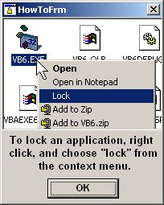



## AppLock\! 2, an application locking tool

### Description

Here is an update to my last post for AppLock. This one will let you just lock specific applications via context menu. Check it out, and let me know what you think. it MUST be compiled to work :)
 
### More Info
 

             |
---                |---
**Submitted On**   |2002-04-02 14:48:10
**By**             |[Johneboy](https://github.com/Planet-Source-Code/PSCIndex/blob/master/ByAuthor/johneboy.md)
**Level**          |Beginner
**User Rating**    |4.9 (44 globes from 9 users)
**Compatibility**  |VB 6\.0
**Category**       |[Complete Applications](https://github.com/Planet-Source-Code/PSCIndex/blob/master/ByCategory/complete-applications__1-27.md)
**World**          |[Visual Basic](https://github.com/Planet-Source-Code/PSCIndex/blob/master/ByWorld/visual-basic.md)
**Archive File**   |[AppLock\!\_267984422002\.zip](https://github.com/Planet-Source-Code/johneboy-applock-2-an-application-locking-tool__1-33361/archive/master.zip)

